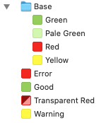

# MakeColors

Converts a simple list of color definitions to asset catalogs for Xcode, resource XML for Android or an HTML preview.

## Installation

Install via [Homebrew](https://brew.sh):

```
brew tap 5sw/makecolors
brew install make-colors
```

If you don’t use Homebrew you can also install directly from source. Clone the repository or download the release and run `make install` inside the working copy.

## Usage

```
USAGE: make-colors <input> [--ios] [--android] [--html] [--prefix <prefix>] [--output <output>]

ARGUMENTS:
  <input>                 The color list to process. 
        Use - to process the standard input.

OPTIONS:
  --ios/--android/--html  The formatter to use (default: ios)
  --prefix <prefix>       Prefix for color names 
  --output <output>       Output file to write. 
        Use - for standard output.
        Default is the input file name with the appropriate file extension. If
        the input is read from the standard input the default is standard
        output.
  -h, --help              Show help information.
```

## Input format

Each line in your input contains one color definition. That is a name followed by the actual color. We support RGB colors in a few formats similar to CSS:

```
Base/Green #8fd151
Base/PaleGreen #d0f9a9
Base/Red rgb(249, 39, 7)
TransparentRed rgba(255, 0, 0, 128)
Base/Yellow #ff0
```

Colors can also reference other colors by prefixing them with an `@` sign:

```
Error @Base/Red
Warning @Base/Yellow
Good @Base/Green
```

## Output format

### Xcode Asset Catalogs (`--ios`)

The optional prefix followed by a `/` is added in front of the color name. Then for each part separate by / a new folder that provides namespace is inserted in the asset catalogs. Spaces are inserted between CamelCase words. Color references are inserted as copies of the original color.

For the given example input the generated asset catalog looks like this: 



### Android resource XML (`--android`)

The optional prefix, followed by a underscore is added in front of the name. Names are converted from CamelCase to snake_case and / is replaced by underscores as well. Color references the generated color resource also references the original color.

The generated XML for the example input looks like this:

```
<?xml version="1.0" encoding="utf-8"?>
<resources>
    <color name="base_green">#8FD151</color>
    <color name="base_pale_green">#D0F9A9</color>
    <color name="base_red">#F92707</color>
    <color name="base_yellow">#FFFF00</color>
    <color name="transparent_red">#FF000080</color>
    <color name="error">@color/base_red</color>
    <color name="good">@color/base_green</color>
    <color name="warning">@color/base_yellow</color>
</resources>
</xml>
```

### HTML preview (`--html`)

Generates a simple HTML table with the color names, values and a sample.

The generated HTML looks like this:


## Future work

- Support other color formats (HSV, ...)
- Calculate derived colors (blend, change hue/saturation/brightness/alpha)
- Support for dark/light mode
- Improved error reporting in the parser
